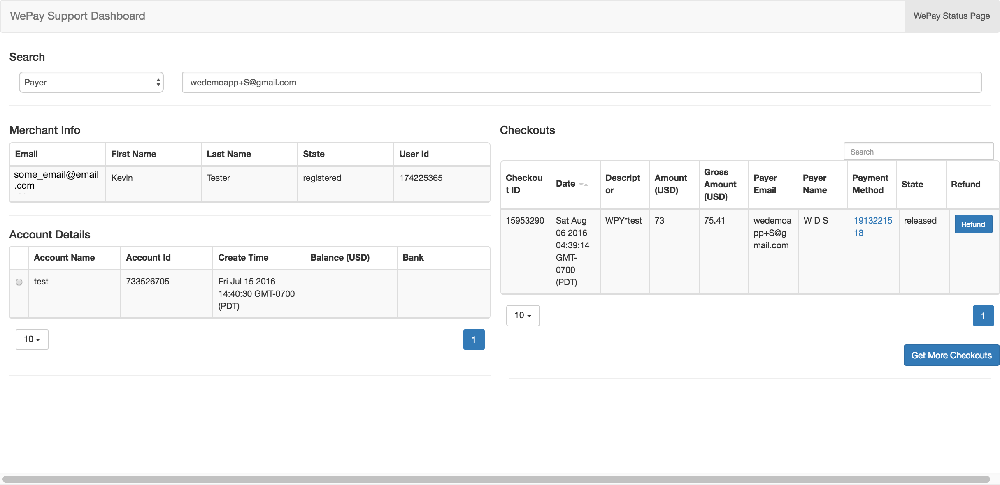
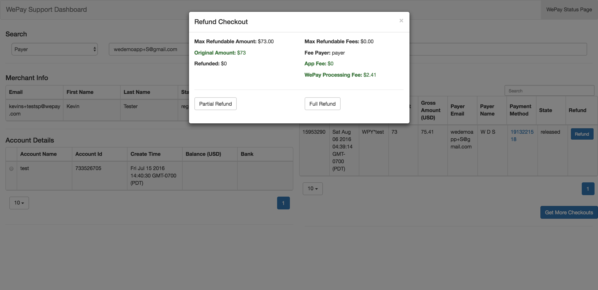
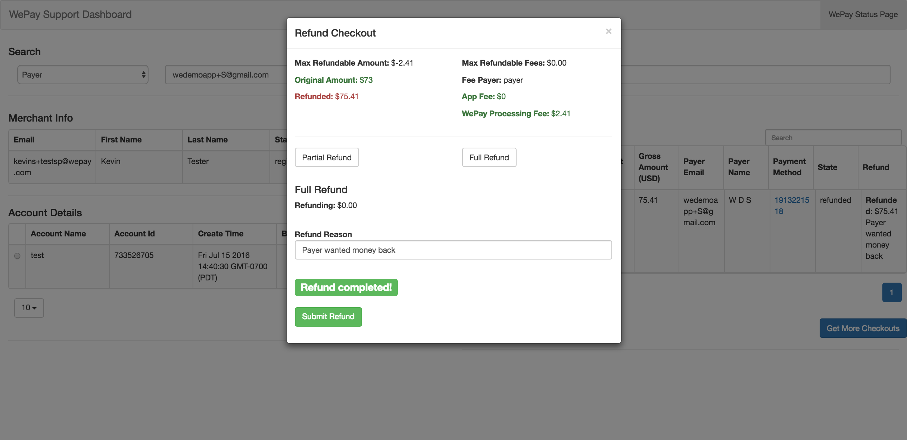

Kvasir Use Cases
=====================
This page will explain what functionality Kvasir was built for and how to work with it in common use cases.

Features
----------------
 Kvasir is built to perform the following actions:  
    - account lookups
        - account statuses
        - withdrawal info
    - user lookups
    - resending user confirmation
    - refunding checkouts
    - credit card lookups

The combination of all of these actions allows you to complete most custom support items for your users.

.. figure:: images/KvasirLiveSnapshot.png
    :align: center
    :scale: 75%

    A snapshot of what Kvasir looks like in action.

Account and User Lookups
------------------------------
A common question from users is 'Why can't I withdraw funds?'  And the first thing a customer support rep should check is if the user completed KYC.  To do that, we need to do an account lookup and check if the user has a bank account tied to the account.

**Any action involving a user requires that we get their email**.

To perform an account lookup:
    1) Go to the search bar and make sure the select box is set to "User" since we are searching for a merchant
    2) Type in the merchant's email
    3) Hit enter and wait.  You should see a set of spinning animations indicating that Kvasir is fetching.
    4) Once the spinners stop, there will be 2 tables
        a) A table that has the merchant's information (name, email and whether or not they've confirmed their email)
        b) A table with the merchant's accounts
    5) Table *b* contains a column with the merchant's bank info.  If that column is blank, then the account does not have an associated bank account

.. note::
    If the spinners stop and no tables appear, it is because an error occurred.  You should receive an error message that tells you why it died, but that's dependent on how you implemented the middleware.

.. figure:: images/KvasirUserAccountLookup.png
    :align: center

    What Kvasir looks like after a merchant lookup.  Kvasir will display the user's information along with all of their registered accounts on your application.

During these steps, you can also check to make sure that the user has confirmed their email with WePay.  The user table has a "State" column that tells you what state the user is in.  If the user's state is not "Registered", then there will be box on the screen that will allow you to resend the user the confirmation email so that they can complete registration.

Performing Refunds
-------------------
Another common operation is issuing refunds to payers.  Kvasir can handle both full and partial refunds with some caveats.

In both cases, you'll want to get the payer's email address that they entered when making the payment.

.. note::
    It is possible that you do not associate a payer's email with the checkout.  In that case, you cannot use Kvasir for this.  Allowing for more searchable options is part of the future plans.

First set the select box to be "Payer" to indicate that you are searching payer information, not merchant information.  Once you enter in their email address, you'll see the spinning wheels indicating that Kvasir is working.  It should come back with a table that has all of that payer's checkouts.  If the table is empty or you receive an error message, it means that no payer with that email exists in your system.

.. figure:: images/KvasirPayerLookup.png
    :align: center

    You can also look payer's up independently of doing a merchant lookup.  This will display all of the payer's payments to different merchants on your platform.

With that list of checkouts, you need to identify which one the payer wants to refund.  You can use the time of the checkout to help narrow it down.  Once you know which checkout it is, click on the radio button for that row.  

This will cause Kvasir to go fetch more information about the checkout including:
    - Information about the merchant
    - Information about the account
    - All of the information about the checkout from the WePay API

    After selecting a checkout, Kvasir will look up the merchant associated with the transaction and pull more info from the WePay API.

Once we have all of this, we can perform the refund.  If the refund hasn't already been refunded, you will see a blue button in a column titled "Refund."  Clicking on that button will bring up a modal that includes information about the checkout along with two options - full and partial refund.

    When you click on the **refund** button, this modal will appear and allow you to issue a full or partial refund.

When you do a full refund, you will refund the original amount paid to the merchant as well as all app and processing fees.  Clicking the full refund button will ask you to enter a reason for the refund.  This is may be sent to the merchant depending on your app configuration, so be careful what you put in.  

For a partial refund, you get to decide how much of the original amount paid to the merchant and how much of the app fees you want to refund.  There are three fields that appear when you click partial refund - amount, percentage, and fees.  The amount and percentage field are tied together.  This was designed to make issuing a refund easier.  If your refund policy is that you only refund half of the amount paid to the merchant, you can type in "50" into the "Percentage" field and Kvasir will calculate what 50% of the amount is for you right there.  Takes out some of the guess work in calculating refunds.

If you leave a field blank, the default value will be 0.  So if you want to refund the entirety of the amount paid to the merchant but keep the app fees, you can do that in a partial refund.

.. note::
    The WePay processing fees are untouchable when doing a partial refund.

Partial refunds also require a reason.  After you type in the reason, go ahead and press enter and the refund will happen.  If the refund is successful, you will see a green box that says, "Refund successful!" and the row in the table will update with the refund information.  This update is actually Kvasir requesting the checkout object again from the WePay API to see if the state changed.  If it doesn't update, don't be alarmed.  Sometimes it takes a while for the checkout object to update, but if you see the "Refund successful" message, that means that the refund went through.

    After a refund is successful, you will see a green confirmation box, and the row that contains that checkout will also update to reflect how much was refunded and why the checkout was refunded.

Potential Refund Errors
~~~~~~~~~~~~~~~~~~~~~~~~~~
Any errors sent back from the WePay API will be displayed in the modal above the submit button.

The most common error is trying to refund the checkout before the checkout is in state "released."  The WePay API will return an error in this case, but the state of the checkout is also included in the checkouts table, so you can check before attempting the refund.

Credit Card Lookups
---------------------
Another common action is getting information about a tokenized card.  This can be especially helpful during the refund process if you want to verify the identity of the person who is requesting the refund.  The checkout object holds the tokenized payment method, and we can fetch the information attached to that token, including the owner's name and the last four digits of their credit card.

You can do a credit card lookup by clicking on the value in the *payment_method* column of the checkouts table.  During the refund process, this can only be done after you click which checkout you want to refund.  When you click that value, Kvasir will go fetch the card's information from WePay and render it underneath the checkout table.

.. figure:: images/KvasirCreditCardLookup.png
    :align: center

    Looking up a credit card can help a user verify the identity of a payer